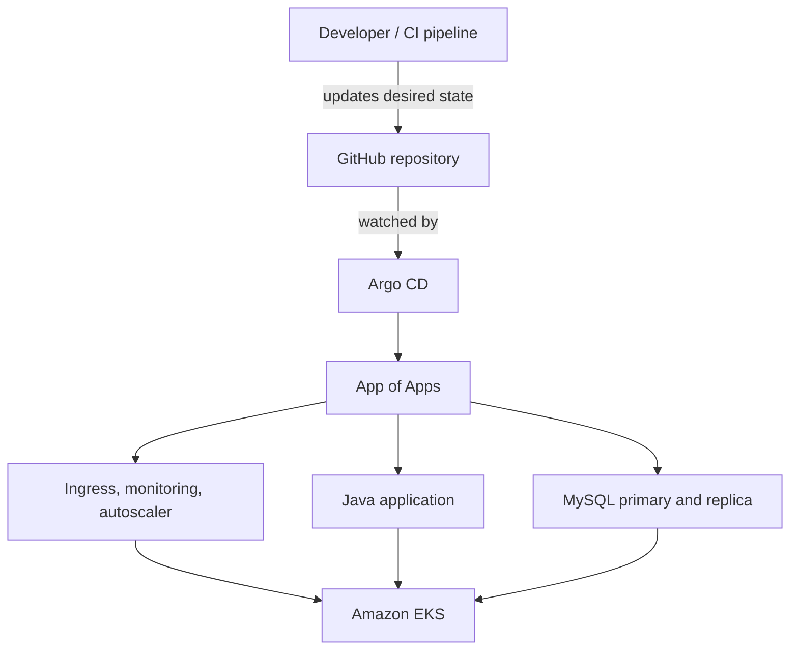

# GitOps Deployment Platform on AWS EKS

This project demonstrates a production-style GitOps workflow for deploying and operating a Java application on Amazon EKS. Argo CD continuously reconciles the Kubernetes cluster with this repository, making Git the source of truth for application, database, ingress, monitoring, and autoscaling configuration.

## Project Highlights

- Implements the Argo CD **app-of-apps** pattern to manage multiple workloads from one root application.
- Deploys a containerized Java application from Amazon ECR with two replicas.
- Installs MySQL in replication mode through the Bitnami Helm chart.
- Exposes the application through the NGINX Ingress Controller and an AWS load balancer.
- Installs the Prometheus community monitoring stack for cluster and workload observability.
- Runs the Kubernetes Cluster Autoscaler with AWS node-group auto-discovery.
- Enables automated synchronization, pruning, and self-healing to prevent configuration drift.
- Uses multi-source Argo CD Applications to combine upstream Helm charts with environment-specific values stored in Git.

## Architecture



### GitOps Deployment Flow

1. A developer or CI pipeline updates a Kubernetes manifest, Helm values file, or container image tag in Git.
2. Argo CD detects the difference between the Git state and the live EKS cluster.
3. Automated sync applies the change to the cluster.
4. Argo CD continuously self-heals changed resources and prunes resources removed from Git.
5. Kubernetes performs the rolling update while Prometheus and Grafana provide operational visibility.

## Technology Stack

| Area | Technologies |
| --- | --- |
| Cloud | AWS, Amazon EKS, Amazon ECR, Elastic Load Balancing |
| GitOps | Argo CD, Git, GitHub, app-of-apps pattern |
| Containers | Docker, Kubernetes |
| Packaging | Helm, multi-source Argo CD Applications |
| Application | Java, Maven |
| Data | MySQL, Bitnami MySQL chart, EBS-backed persistent volumes |
| Networking | NGINX Ingress Controller, Kubernetes Services, DNS |
| Observability | Prometheus, Grafana, kube-prometheus-stack |
| Scaling | Kubernetes Cluster Autoscaler, AWS Auto Scaling groups |
| Security | Kubernetes RBAC, non-root containers, seccomp, read-only root filesystem, AWS IAM |

## Repository Structure

```text
.
├── argocd
│   ├── applications
│   │   ├── auto-scaler.yaml
│   │   ├── java-app.yaml
│   │   ├── mysql.yaml
│   │   ├── nginx-ingress-controller.yaml
│   │   └── prometheus.yaml
│   ├── helm
│   │   ├── bitnami-mysql/values-dev.yaml
│   │   ├── ingress-nginx/values-dev.yaml
│   │   └── prometheus/values-dev.yaml
│   └── multi-apps/app-of-apps.yaml
├── auto-scaler/auto-scaler.yaml
├── java-app/java-deployment.yaml
└── nginx-app/nginx-app.yaml
```

## Managed Applications

| Application | Source | Namespace | Purpose |
| --- | --- | --- | --- |
| `java-app` | Local Kubernetes manifests | `default` | Deploys the Java service, ConfigMap, Secret, Service, and Ingress |
| `mysql` | Bitnami Helm chart + Git values | `default` | Runs a MySQL primary and secondary with persistent storage |
| `nginx-ingress` | Ingress-NGINX Helm chart + Git values | `default` | Routes external traffic to the Java service and exposes metrics |
| `prometheus-stack` | kube-prometheus-stack Helm chart + Git values | `monitoring` | Provides Prometheus and Grafana monitoring components |
| `auto-scaler` | Local Kubernetes manifests | `kube-system` | Scales EKS worker capacity using AWS Auto Scaling groups |

## Prerequisites

- An Amazon EKS cluster and working `kubectl` access.
- Worker nodes in an AWS Auto Scaling group with the discovery tags expected by the autoscaler manifest.
- The Amazon EBS CSI driver and a compatible storage class such as `gp2` for MySQL persistence.
- Argo CD installed in the cluster.
- An Amazon ECR repository containing the Java application image.
- AWS IAM permissions for the Cluster Autoscaler, preferably supplied through EKS Pod Identity or IAM Roles for Service Accounts.
- A Kubernetes image pull secret named `docker-secret` if the ECR image is not pulled through the worker-node or pod IAM identity.
- Helm and the Argo CD CLI for local administration.

> Before deployment, replace the ECR image URI, AWS region, cluster autoscaler discovery tag, ingress hostname, database credentials, and storage class with values for your environment.

## Installation

### 1. Clone the repository

```bash
git clone https://github.com/ManhTrinhNguyen/GitOps.git
cd GitOps
```

### 2. Install Argo CD

```bash
kubectl create namespace argocd
kubectl apply --server-side --force-conflicts \
  -n argocd \
  -f https://raw.githubusercontent.com/argoproj/argo-cd/stable/manifests/install.yaml
```

Wait for the Argo CD components:

```bash
kubectl wait --for=condition=Available deployment --all \
  -n argocd \
  --timeout=300s
```

### 3. Install the Argo CD CLI

On macOS:

```bash
brew install argocd
```

For other operating systems, follow the official Argo CD CLI installation documentation.

### 4. Access Argo CD

In one terminal, forward the API server port:

```bash
kubectl port-forward svc/argocd-server -n argocd 8080:443
```

In another terminal, retrieve the initial admin password and log in:

```bash
argocd admin initial-password -n argocd
argocd login localhost:8080 --username admin --insecure
```

### 5. Configure environment-specific values

Review and update these files before the first sync:

- `java-app/java-deployment.yaml`
- `auto-scaler/auto-scaler.yaml`
- `argocd/helm/bitnami-mysql/values-dev.yaml`
- `argocd/helm/ingress-nginx/values-dev.yaml`
- `argocd/helm/prometheus/values-dev.yaml`

Commit and push the changes so Argo CD can use the repository as the desired state.

### 6. Bootstrap the app-of-apps application

```bash
kubectl apply -n argocd -f argocd/multi-apps/app-of-apps.yaml
```

This root Application discovers the manifests in `argocd/applications/` and creates each child Application. The child applications then deploy their Kubernetes manifests or Helm charts.

## Verify the Deployment

```bash
argocd app list
argocd app get app-of-apps
kubectl get applications -n argocd
kubectl get pods -A
kubectl get ingress,svc -n default
kubectl get pods -n monitoring
kubectl get deployment cluster-autoscaler -n kube-system
```

Inspect autoscaler activity:

```bash
kubectl logs -n kube-system deployment/cluster-autoscaler --tail=100
```

## Test Self-Healing

The applications use automated synchronization with `selfHeal: true`. Test reconciliation by changing a Git-managed field directly in the cluster:

```bash
kubectl scale deployment java-app --replicas=1
kubectl get deployment java-app --watch
```

Argo CD should detect the drift and restore the replica count declared in Git.

## Update and Roll Back

### Deploy a new application version

1. Build and push a new image to Amazon ECR.
2. Update the image tag in `java-app/java-deployment.yaml`.
3. Commit and push the change.
4. Watch Argo CD synchronize the application and Kubernetes complete the rolling update.

```bash
argocd app get java-app --refresh
kubectl rollout status deployment/java-app
```

### Roll back

Because Git is the source of truth, the preferred rollback is to revert the failed Git commit and push the revert:

```bash
git revert <commit-sha>
git push origin main
```

Argo CD will reconcile the cluster to the reverted state. Argo CD's **History and Rollback** view can also restore an earlier revision, but Git should be updated afterward so automated sync does not overwrite the rollback.

## Security Considerations

This repository is a learning and portfolio project. Apply these changes before using it in a shared or production environment:

- Do not store database passwords or other credentials in Git, even when values are base64-encoded. Use AWS Secrets Manager with External Secrets Operator or the Secrets Store CSI Driver, or use Sealed Secrets/SOPS.
- Replace static image-pull credentials with EKS Pod Identity, IRSA, or ECR permissions assigned to worker nodes where appropriate.
- Give the Cluster Autoscaler a least-privilege AWS IAM role and avoid long-lived AWS access keys.
- Pin container images to immutable versions or digests instead of using `latest`.
- Restrict Argo CD projects by approved source repositories, destination namespaces, and resource types.
- Configure TLS and a controlled DNS name for the application ingress.
- Review resource requests, limits, Pod Security settings, NetworkPolicies, and disruption budgets for each workload.

## Troubleshooting

### An application is `OutOfSync`

```bash
argocd app diff <application-name>
argocd app get <application-name>
argocd app sync <application-name>
```

### A Helm application cannot load its values file

Confirm that the Git source has `ref: values` and the Helm source references the file with the `$values/` prefix. Also confirm that the repository URL, revision, and path are correct.

### MySQL PVCs remain `Pending`

```bash
kubectl get storageclass
kubectl describe pvc -n default
kubectl get pods -n kube-system | grep ebs
```

Verify that the requested storage class exists, the EBS CSI driver is running, and the worker-node Availability Zone is compatible with volume provisioning.

### The Java application cannot pull its image

```bash
kubectl describe pod -l app=java-app
kubectl get secret docker-secret
```

Verify the ECR URI, image tag, AWS region, and IAM or image-pull-secret configuration.

### The Cluster Autoscaler does not add nodes

Check the autoscaler logs, AWS IAM permissions, Kubernetes version compatibility, node-group discovery tags, and the minimum/maximum size of the Auto Scaling group.

## Skills Demonstrated

- GitOps architecture and declarative continuous delivery
- Argo CD app-of-apps and multi-source Application design
- Kubernetes workload, networking, RBAC, storage, and security configuration
- Helm-based deployment and environment-specific values management
- Amazon EKS and ECR integration
- Cluster capacity management and operational troubleshooting
- Monitoring platform deployment with Prometheus and Grafana
- Safe deployment, drift correction, and Git-based rollback practices


